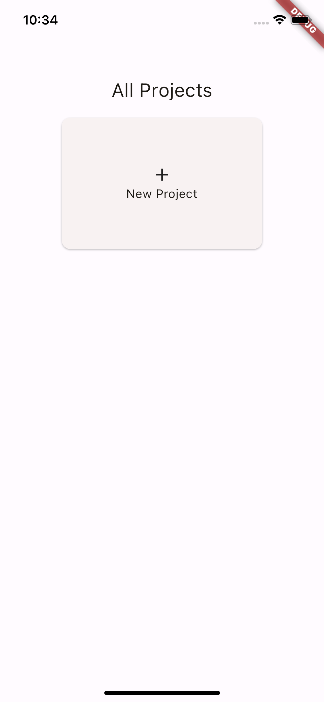
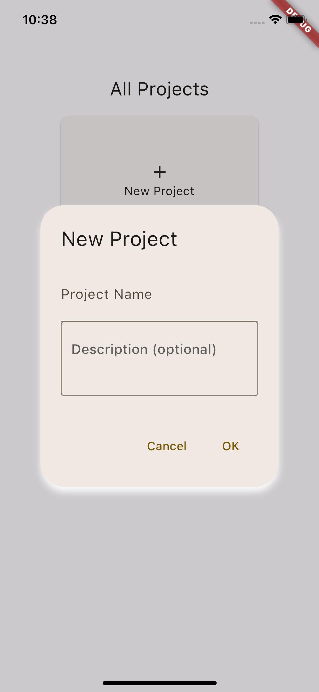
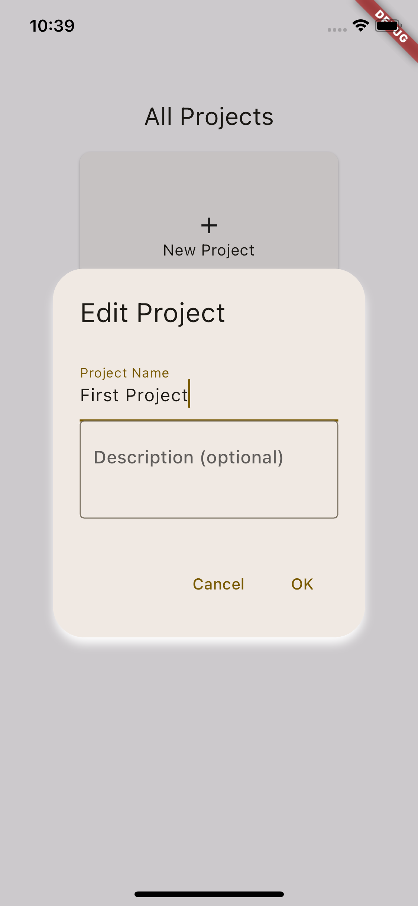
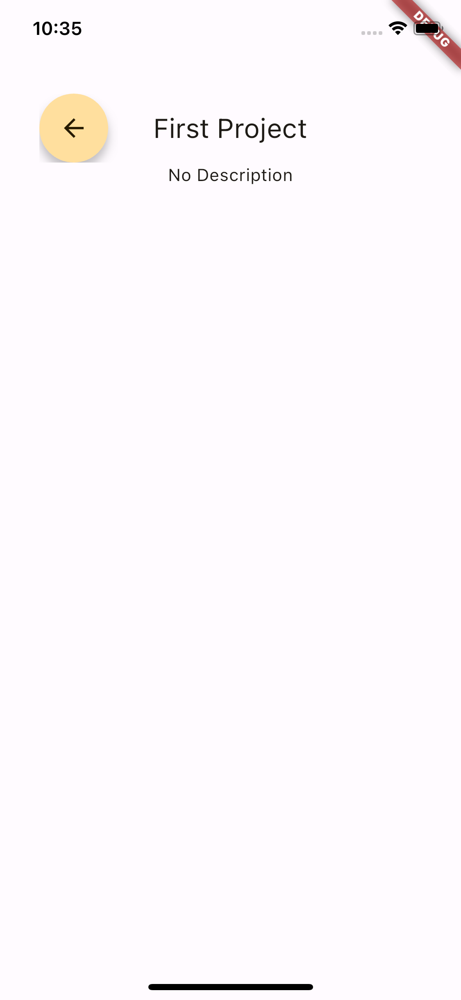
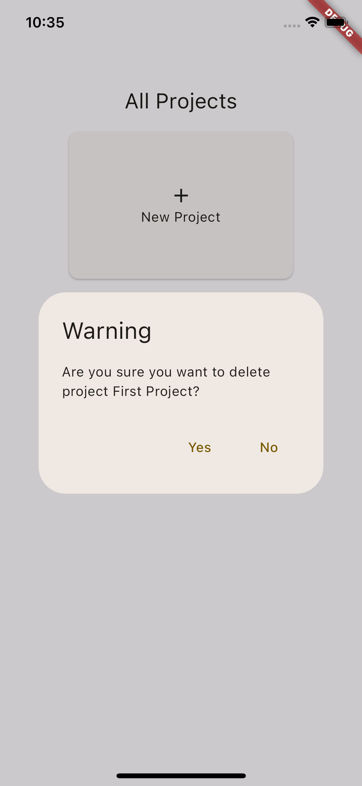
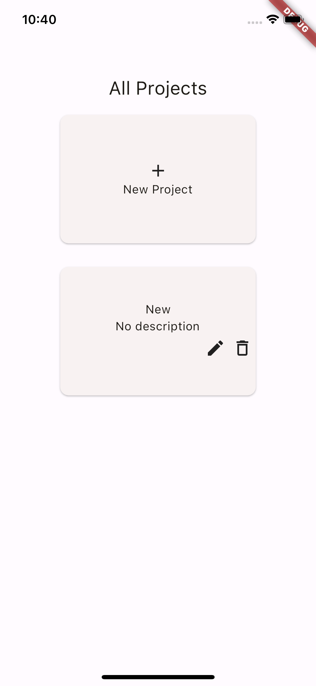

# dreamer_flutter_boilerplate

This is a boilerplate to create a simple flutter app with db connections on platform device.

## App Demo

## App Structure Overview

### Database

Database connection is defined in database_util.dart file.
You can replace 'dreamer_app.db' with your desired database name.
Take macOS platform as an example, the db file can be found in /Users/______/Library/Containers/com.example.dreamerApp/Data/Documents

Below are the database table design:
 
projects
|  id  |     name     | description |
| ---- | ------------ | ----------- |
| uuid | project name |     NULL    |
 
appstate
|        key       | value |
| ---------------- | ----- |
| currentProjectId | NULL  |

### Models

Models defined under the /models folder are objects to be used as a bridge between database data and the views. Normally, they would have the same attributes as the database structures, but they can be modified to hold additional properties.

### Views

Views defined under the /components folder are the UI components to be rendered on the pages.

### Providers

Providers defined under the /providers folder are async calls to get data from the local database defined above. Using providers enables us to read/write directly from/to the database to avoid data conflict. Data returned from database calls can then be consumed by using a FutureBuilder (used in the FutureBuilderWrapper class), and processing the data to be displayed in the views.  

There might be situations where we want to use local page state instead, those can be achieved by defining a local variable under the page's state class, then call setState() to update the state.  
Reference: https://api.flutter.dev/flutter/widgets/StatefulWidget-class.html
 